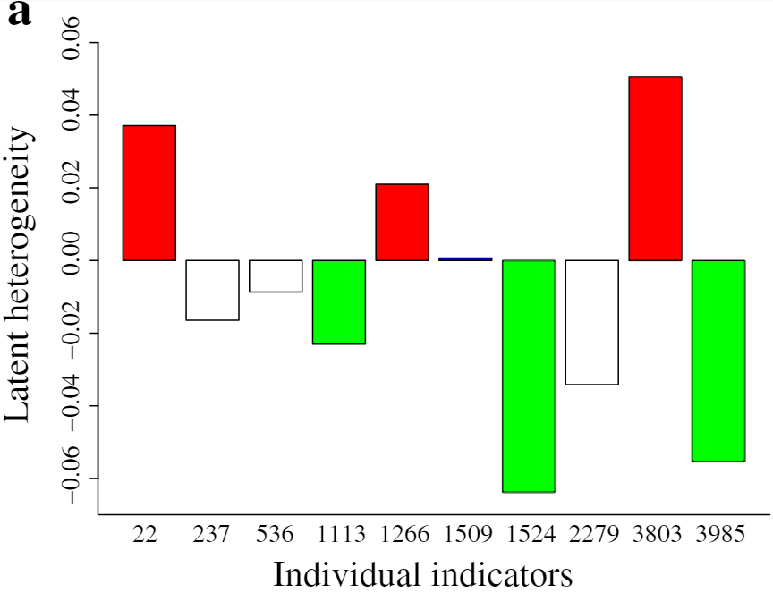

# HospitalReadmission_HCMS2018
## About
### This is a demo to demonstrate the work of hospital readmission risk assessment, from one of the research projects listed in [Suiyao Chen's Homepage](https://sites.google.com/mail.usf.edu/suiyaochen-professional/publication?authuser=0). 
### The paper [Claims Data-driven Modeling of Hospital Time-to-Readmission Risk with Latent Heterogeneity](https://www.researchgate.net/publication/322700706_Claims_data-driven_modeling_of_hospital_time-to-readmission_risk_with_latent_heterogeneity) has been published in [Health Care Management Science](https://link.springer.com/article/10.1007/s10729-018-9431-0). 

## Instructions
### Due to the confidential data permission, the demo data only contains partial results for illustration purpose.
- **functions_demo.R** is used to show how to generate the C-index from modeling results in the demo.
- **functions.R** contains the functions for all models compared in the project.
- **Plot.R** is one demo to generate the plot for latent heterogeneity quantification. 
#### The plot is shown as below:

